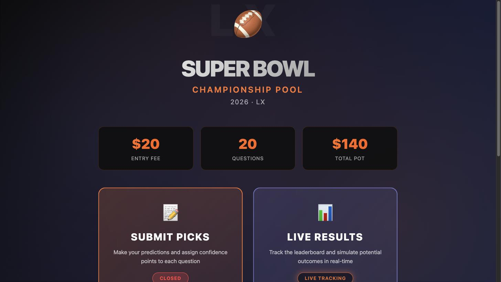
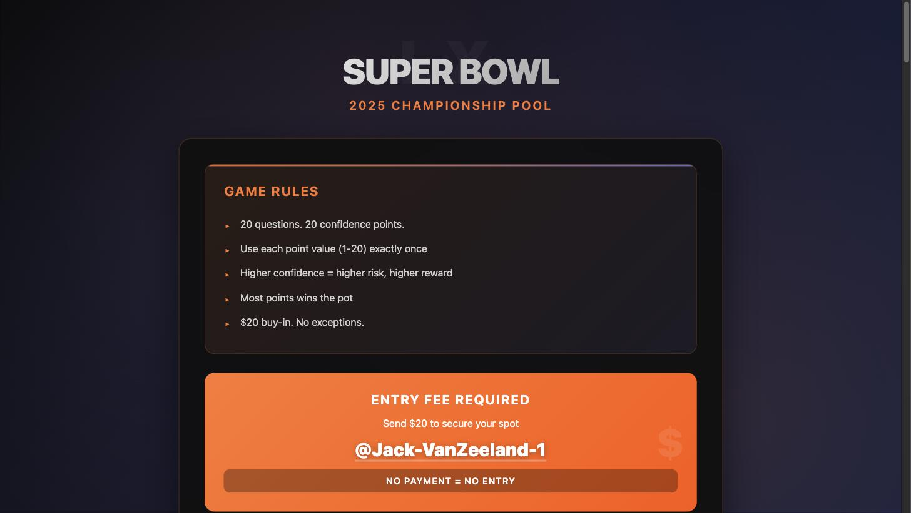
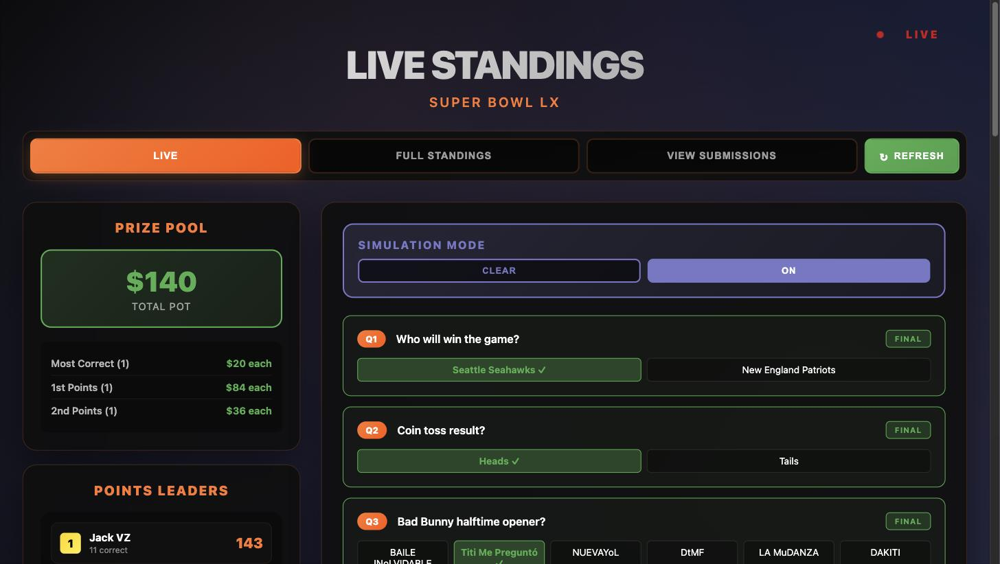

# 🏈 Super Bowl LX Pool

A confidence-point pick 'em pool for Super Bowl LX (2026) — pick winners for 20 questions, weight each pick with a unique confidence value from 1–20, and track the live leaderboard as results come in.

**Live site:** [jackvanzeeland.com/projects/superbowl](https://jackvanzeeland.com/projects/superbowl/)

## Screenshots

| Home | Submit Picks | Live Standings |
| --- | --- | --- |
|  |  |  |

## How it works

- **$20 entry fee** per player, paid into a shared pot
- **20 questions** covering the game (winner, coin toss, halftime show, scoring plays, and more)
- Each player assigns **confidence points 1–20** to their picks, using each value exactly once — higher confidence on a pick means a bigger score swing if it's right (or wrong)
- Once picks are locked in, the **live standings** page tracks the leaderboard in real time as questions are graded, including prize-pool payouts and a simulation mode for exploring how remaining questions could shake out

## Tech stack

Static front end, no build step or framework — plain HTML/CSS/vanilla JS served from an S3 bucket.

- **Frontend:** HTML/CSS/JS, hosted on AWS S3
- **Backend:** AWS API Gateway → AWS Lambda (`lambda_function.mjs`) → DynamoDB
- Submissions are validated server-side in the Lambda (name, exactly 20 answers, unique confidence values 1–20) before being written to DynamoDB

## Project structure

| File | Purpose |
| --- | --- |
| `index.html` | Landing page with pool overview (entry fee, pot, question count) |
| `survey.html` | Pick 'em submission form — where players make their picks |
| `results.html` | Live standings, leaderboard, and results simulator |
| `submissionsConverter.html` | Admin tool to convert exported CSV data into `submissions.json` |
| `lambda_function.mjs` | AWS Lambda handler that validates and stores submissions in DynamoDB |
| `questions.json` | The 20 pool questions and their answer options |
| `key.json` | Answer key with the graded result for each question |

## License

MIT — see [LICENSE](LICENSE).
